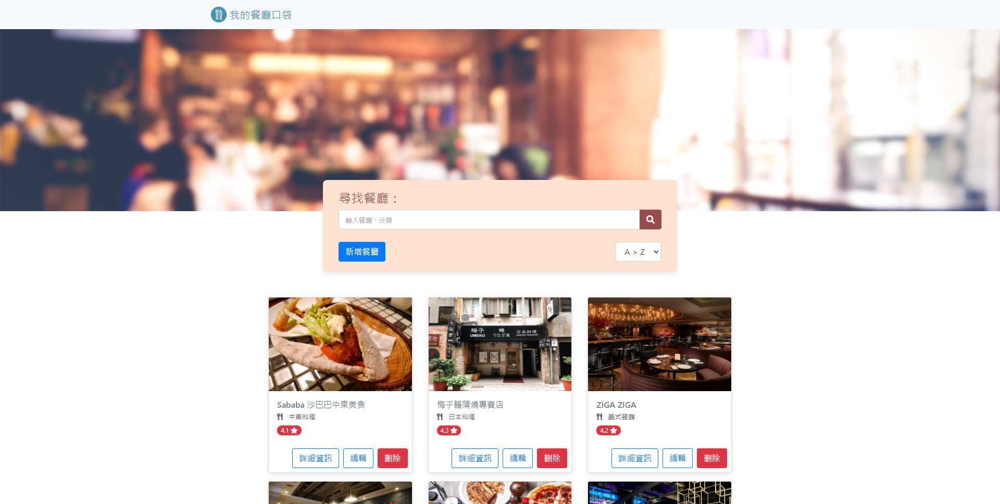

# 我的餐廳清單

## 介紹
紀錄收藏的口袋餐廳，可以增刪改查餐廳資料、檢視詳細資訊、連結地圖
## 功能
- 瀏覽所有餐廳
- 瀏覽餐廳的詳細資訊
- 以名稱、類別搜尋餐廳
- 連結餐廳的Google地圖
- 新增餐廳
- 編輯餐廳
- 刪除餐廳
- 排序下拉選單
- 使用者認證(一般註冊、Facebook登入)
## 開始使用
1. clone專案
2. 進入專案資料夾，安裝所需套件
```bash
npm install
```
3. 啟動專案
```bash
npm run dev
```
4. 出現此訊息代表成功運行
```bash
Listening on http://localhost:3000
```
5. 產生種子資料

| name  | email             | password  | restaurantList |
|-------|-------------------|-----------|----------------|
| user1 | user1@example.com | 12345678  | #1, #2, #3     |
| user2 | user2@example.com | 12345678  | #4, #5, #6     |

```bash
npm run seed
```
## 環境
- Node.js 14.17.6
- MongoDB 5.0.4
## 開發工具
- express 4.17.1
- express-handlebars 6.0.1
- express-session 1.17.2
- passport 0.5.2
- passport-local 1.0.0
- passport-facebook 3.0.0
- bcryptjs 2.4.3
- method-override 3.0.0
- connect-flash 0.1.1
- image-url-validator 1.0.4
- dotenv 14.2.0
- mongoose 6.0.5
- Bootstrap 4.6.1
- Font-awesome 5.8.1